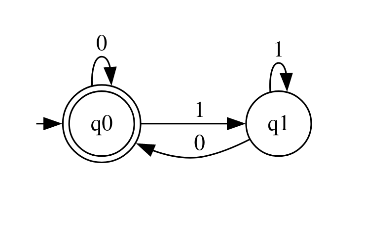

# CSE 355 Machine Design
A python library to allow students to complete machine design problems in ASU's CSE 355 Online offering

> [!IMPORTANT]
> Currently only DFAs and NFAs are supported. PDAs and Turing Machines are in the works for the next few releases.

## Installation

> [!IMPORTANT]
>  **Requires: Python 3.10+ to use**

This library can be installed via the command:
```bash
pip install cse355-machine-design
```

## Usage
This library has four main usage aspects: machine defintion, machine simulation, machine visualization, and machine submission.
### Machine Definition
Machine definition involves defining a machine with a formal mathematical definition. This library borrows its syntax heavily from Michael Sipser's 
*Introduction to the Theory of Computation* [^1].

[^1]: https://math.mit.edu/~sipser/book.html

See below for example defintions for various machine types

#### DFAs

In order to define a deterministic finite automata (or DFA) in this library, we can use the following example as a guide:
```python
from cse355_machine_design import DFA

Q = {"q0", "q1"}
Sigma = {"0", "1"}
delta = {
    ("q0", "0"): "q0",
    ("q0", "1"): "q1",
    ("q1", "0"): "q0",
    ("q1", "1"): "q1",
}
q0 = "q0"
F = {"q0"}

M = DFA(Q, Sigma, delta, q0, F)
```

Here we are defining a DFA called `M` with:
1. the states `q0` and `q1` (denoted by `Q`)
2. an alphabet containing only `0` and `1` (denoted by `Sigma`)
3. a transition function (denoted by `delta`) that maps a `current state, input symbol` pair to a new state.
4. a start state (denoted by `q0`)
5. and a set of final states (denoted by `F`)

Together these make up the 5-tuple discussed in Sipser on page 35.

When defining such DFAs, replace the definitions of each variable as you see fit. When you run the code, the library will let you know if your DFA is **invalid** in the sense that it violates one of the restrictions of DFAs. A not necessarily comprehensive list of possible violations is found below:
+ Not all states found in transition function
+ Transition function contains states not defined in the state set
+ Transition function contains symbols not defined in the alphabet
+ Start state is not found in the state set
+ Some final/accepting states are not valid states.

#### NFAs

There are very few differences between NFAs and DFAs in this library, but for completeness here is an example covering the common ways to define an NFA:

```python
from cse355_machine_design import NFA

Q = {"q0", "q1", "q2"}
Sigma = {"0", "1"}
delta = {
    ("q0", "0"): {"q0", "q1"},
    ("q1", "1"): {"q2"},
    ("q2", "_"): {"q0"}
}
q0 = "q0"
F = {"q2"}

M = NFA(Q, Sigma, delta, q0, F)
```
The syntax and semantics are identical to the DFA, however we change the constructor to `NFA` and are no longer as constrained when defining our transition function `delta`.

Additionally, we can see the use of the character `_` in the transition function. This is the character used by default to represent epsilon transitions.

> [!NOTE]
> In the rare cases in which you would like to have `_` as part of your input symbols, you can change the character representing epsilon via the constructor:
> ```python
> M = NFA(Q, Sigma, delta, q0, F, epsilon_char="$")
> ```
> Here we define the machine to treat `_` as a normal input symbol and to use `$` for epsilon internally.
>
> Do note that this feature should be used as little as possible as it causes the library to perform additional runtime checks and may cause errors in existing codebases.

### Machine Simulation

An additional feature of this library is to perform simulation of a machine on a given input string.

> [!NOTE]
> The syntax is the same across all machine types.

#### Checking If A String Is Accepted

We can check if a string is accepted using the `evaluate` method found on all machine objects.

```python
M.evaluate("10100")
```

This evaluates the machine `M` on the input string `10100`.

If there is a mismatch between the charaters in the string and the alphabet of the machine, the library will throw an error.

The method returns a `bool` representing if the machine accepted or rejected the string.

#### Tracing Simulation

When testing automata it is often very helpful to have some level of feedback on how strings are being evaluated.

If you wish to enable tracing, use the `enable_trace` flag in the `evaluate` method.

```python
M.evaluate("10100", enable_trace = 1)
```

Here we are going to check if `M` accepts or rejects the string `10100` with a **trace level** of `1`. A trace level is an integer representing how much tracing to do. A lower number (minimum 0: no tracing) represents less tracing and a higher number represents more tracing.

Different machine types offer different maximum tracing levels. The current maximums can be seen here:

| Machine Type | Max. Tracing Level |
| ------------ | ------------------ |
| DFA          | 1                  |
| NFA          | 2                  |

### Machine Visualization

This entire time we have been discussing the formal definitions of machines, however it is often nice to have a state diagram to visualize the machine. This aids in the design loop by providing visual feedback on the automatas structure.

To create a state diagram, we can make use of the `display_state_diagram` method on any machine object:

```python
M.display_state_diagram()
```

This code will generate an HTML file containing your state diagram in the current directory and will **automatically** open your default web browser to render the file.

A sample screenshot of a generated state diagram is seen below:



### Machine Submission

Especially important for academic use of this library is the functionality to export student work for submission.

When preparing your machines for submission follow the guide below:

Please consider the following example question set:

> 1. Design a DFA that accepts the language {w | w is of even length}
> 2. Design a DFA that accepts the language {w | w has at least three zeros}

Suppose you write your two defintions that you decided to call `M_EVEN` and `M_THREE_Z`.

Before you do anything else, first add the following line of code to the top of the file:

```python
from cse355_machine_design import registry
```

Next suppose you want to submit `M_EVEN` for the first problem. Then, after your machine definition, you would write:

```python
M_EVEN.submit_as_answer(1)
```

For question two you would write:

```python
M_THREE_Z.submit_as_answer(2)
```

Finally, you can add the following line to the bottom of the file:
```python
registry.export_submissions()
```

That will create a JSON file called `submissions.json` that you can upload to Gradescope.

> [!TIP]
> It may help to comment out the calls to `display_state_diagram` in order to make the whole generation process faster and more consistent.
